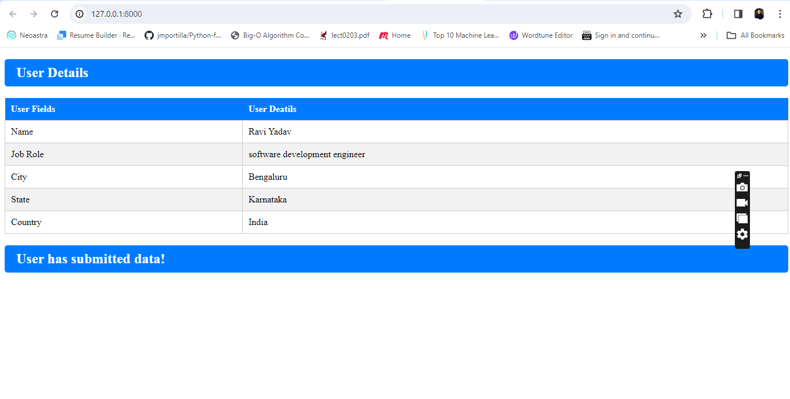

# Django App Setup Guide

This guide provides step-by-step instructions for setting up and running the Django app.

## Prerequisites

- Python 3.x installed on your system
- Anaconda or Miniconda installed ([Installation Guide](https://docs.conda.io/projects/conda/en/latest/user-guide/install/index.html))

## Setup Instructions

1. **Clone the Repository:**
    ```bash
    git clone https://github.com/raviyaduvanshi10/speech_recognizer.git
    cd speech_recognizer

2. **Create Conda Enviornment:**
    ```bash
    conda env create -f environment.yml
    conda activate myDjangoEnv

3. **Run the Django Development Server:**
    ```bash
   python manage.py runserver

4. **Accessing the Application:**
    ```bash
    Once the server is running, access the application at http://localhost:8000.

5. **Using the Application:**
    ```bash
    Please tell your name ...
    Listening Text ...
    Recognizing Text ...
    Ravi Yadav
    Please tell your job position ...
    Listening Text ...
    Recognizing Text ...
    software development engineer
    Please tell your city ...
    Listening Text ...
    Recognizing Text ...
    Bengaluru
    Please tell your state ...
    Listening Text ...
    Recognizing Text ...
    Karnataka
    Please tell your country ...
    Listening Text ...
    Recognizing Text ...
    India
    Submitting the data ...
    [28/Feb/2024 16:09:38] "GET / HTTP/1.1" 200 1089

6. **Output:**
    ```bash
    Output Sample
    